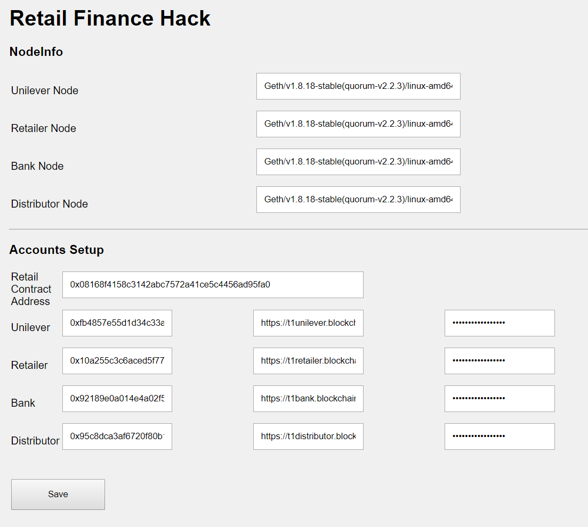

# Consortium Blockchain Hack using Web3.js with Azure Blockchain Service (ABS)
this code uses web3.js to communicate with ABS




## NodeInfo : 
  Get Ethereum Node Information

```
	web3.eth.getNodeInfo(function(error, result){
		if(error){
			console.log( "error" ,error);
		}
		else{
			console.log( "result",result );
					
		}
	});
```

## Balance : 
  Get account's Balance
  web3.eth.getAccounts : get account from Ethereum node
  web3.eth.getBalance  : get account's balance
  web3.utils.fromWei   : convert wei to ether

```
	web3.eth.getAccounts(function(error, accounts) {
		if(error) {
			console.log(error);
		}
		$('#Account').val(accounts[0]);
		web3.eth.getBalance(accounts[0]).then(function(result){
			console.log( "Balance : " ,web3.utils.fromWei(result, 'ether'));
			$('#Balance').val(web3.utils.fromWei(result, 'ether'));
		});
	});
